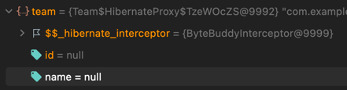
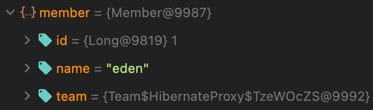
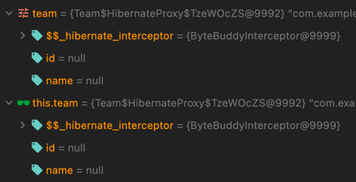
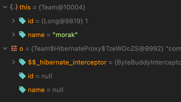
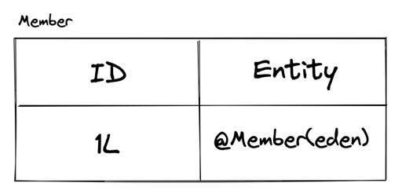
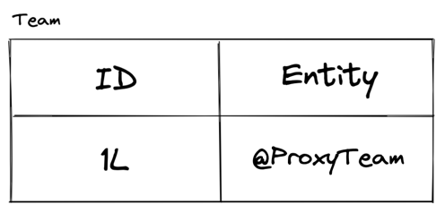

### 개발 환경

> JAVA 11
> 
> Spring Boot 2.6.6
>
> h2

### INTRO

#### fetch type

JPA 는 엔터티간 연관관계를 맺을 시 LAZY 와 EAGER 두 가지 로딩 전략을 사용한다.

LAZY 는 해당 엔터티가 호출될 때 쿼리를 날려 데이터를 가져오고 호출되기 전까지는 프록시 객체 껍데기로만 존재한다.

#### getReferenceById(getById), findById

- getReferenceById 는 위의 fetch type 과 같이 해당 객체가 호출되기 전까지는 프록시로 존재한다.

- findById 는 바로 쿼리를 날려 실제 객체를 반환한다.  

`findById 는 바로 쿼리를 날려 실제 객체를 반환한다` 는 부분적으로 잘못된 개념이었고 이와 관련하여 만난 버그와 해결 과정을 적어보고자 한다.

### 기본 세팅

Member 와 Team 은 1:N 으로 연관 관계를 맺고 있다.

```java

@Entity
@NoArgsConstructor
@Getter
public class Team {

    @Id
    @GeneratedValue(strategy = GenerationType.IDENTITY)
    private Long id;

    private String name;

    @Override
    public boolean equals(Object o) {
        if (this == o)
            return true;
        if (o == null || getClass() != o.getClass())
            return false;
        Team team = (Team)o;
        return Objects.equals(getId(), Team.getId()) && Objects.equals(getName(), Team.getName());
    }

    @Override
    public int hashCode() {
        return Objects.hash(getId(), getName());
    }
}
```

```java

@Entity
@NoArgsConstructor
@Getter
public class Member {

    @Id
    @GeneratedValue(strategy = GenerationType.IDENTITY)
    private Long id;

    private String name;

    @ManyToOne(fetch = FetchType.LAZY)
    private Team team;

    public boolean isTeam(Team team) {
        return this.team.equals(team);
    }
}

```

team 더미 데이터

|ID|NAME|
|---|---|
|1|morak|
|2|woowa|

member 더미 데이터

|ID|NAME| TEAM_ID |
|---|---|---------|
|1|morak| 1       |
|2|woowa| 2       |

처음 설계시, member 를 가져올 때 굳이 team 모든 데이터까지 가져와야 할 필요성을 느끼지 않아 로딩 전략을 LAZY 로 하기로 결정하였다.

그리고 같은 팀인지 확인하기 위하여 team 객체에서 equals 를 재정의해주었다.

### 문제 상황

```java

@Service
@RequiredArgsConstructor
public class ProxyService {

    private final MemberRepository memberRepository;
    private final TeamRepository teamRepository;

    public void test(Long memberId, Long teamId) {
        Member member = memberRepository.findById(memberId).orElseThrow();
        Team team = teamRepository.findById(teamId).orElseThrow();

        return member.isTeam(team);
    }
}

```

member 와 team 을 찾고 member 가 해당 team 의 멤버인지 확인하는 서비스 로직이 있었다.

### 버그 발생

1. findById 로 가져온 객체가 프록시 객체

데이터에서 분명 `eden` 이  `morak` 소속인데 계속 isTeam() 로직에서 false 를 반환하였다.

그래서 디버그를 찍어 보았다.



분명 findById 로 가져왔는데 프록시 객체로 되어있었다.

`findById 는 바로 쿼리를 날려 실제 객체를 반환한다` 는 기존의 생각이 틀렸다.



member 의 team 은 물론 프록시 객체였다.

그런데 두 프록시 객체가 일치한다.

2. 프록시 객체가 같은데 왜 false 를 반환할까

```bash
    public boolean isTeam(Team team) {
        return this.team.equals(team);
    }
```
에서 디버그를 찍어보았다.



여전히 동일한 객체이다. 

오버라이드한 equals 메서드로 들어가보았다.



이 때 this 는 실제 객체가 되었고 파라미터로 들어온 비교 객체는 여전히 프록시 객체이다.

이로 인해 `getClass() != o.getClass()` 분기에서 계속 false 를 반환하는 것이었다.

### 해결 과정

1. findById 로 가져온 객체가 프록시 객체인 이유

처음 member 를 가지고 올 때 lazy 라고 하더라도 해당 연관 객체가 영속성 컨텍스트에 프록시 형태로 저장이 된다.



member 에 team 의 id 가 저장되어 있기때문에 영속성 컨텍스트에 저장이 된다.



그래서 team 을 findById() 로 가져올 때 영속성 컨텍스트에 같은 id 가 있기때문에 실제 데이터를 가져오지 않고 프록시 객체로 설정이 된다.

다만 쿼리문은 여전히 날아간다. 그리고 받은 id 1 에 대한 팀 데이터를 영속성 컨텍스트에 저장하기는 한다.

그런데 왜 굳이 영속성 컨텍스트의 프록시 객체로 설정하는지는 이해가 되지 않았다.

2. 언제 프록시 객체가 실제 데이터를 가진 객체로 바뀔까?

결론부터 말하자면 해당 프록시 객체의 메서드가 호출될 때이다.

```java

public interface ProxyConfiguration {

    // ...
    interface Interceptor {
        
        @RuntimeType
        Object intercept(@This Object instance, @Origin Method method, @AllArguments Object[] arguments)
                throws Throwable;
    }
	class InterceptorDispatcher {

		@RuntimeType
		public static Object intercept(
				@This final Object instance,
				@Origin final Method method,
				@AllArguments final Object[] arguments,
				@StubValue final Object stubValue,
				@FieldValue(INTERCEPTOR_FIELD_NAME) Interceptor interceptor
		) throws Throwable {
			if ( interceptor == null ) {
				if ( method.getName().equals( "getHibernateLazyInitializer" ) ) {
					return instance;
				}
				else {
					return stubValue;
				}
			}
			else {
				return interceptor.intercept( instance, method, arguments );
			}
		}
	}
}

```

프록시 객체의 메서드가 호출되면 ProxyConfiguration 내부의 InterceptorDispatcher 클래스의 intercept 메서드가 먼저 가로챈다.

그리고 ProxyConfiguration.Interceptor 인터페이스에서 선언된 intercept(instance, method, arguments) 메서드를 호출한다.

```java
public class ByteBuddyInterceptor extends BasicLazyInitializer implements ProxyConfiguration.Interceptor {

    // ...


    public Object intercept(Object proxy, Method thisMethod, Object[] args) throws Throwable {
        Object result = this.invoke( thisMethod, args, proxy );
        if ( result == INVOKE_IMPLEMENTATION ) {
            Object target = getImplementation();
            final Object returnValue;
            try {
                if ( ReflectHelper.isPublic( persistentClass, thisMethod ) ) {
                    if ( !thisMethod.getDeclaringClass().isInstance( target ) ) {
                        // ...
                    }
                    returnValue = thisMethod.invoke( target, args );
                }

                // ...

                return returnValue;
            }
            catch (InvocationTargetException ite) {
                throw ite.getTargetException();
            }
        }
        else {
            return result;
        }
    }
    
    protected final Object invoke(Method method, Object[] args, Object proxy) throws Throwable {
        String methodName = method.getName();
        int params = args.length;

        if (params == 0) {
            // ...
        } else if (params == 1) {
            if (!overridesEquals && "equals".equals(methodName)) { // - 1
                return args[0] == proxy;
            } else if (method.equals(setIdentifierMethod)) {
                initialize();
                setIdentifier((Serializable) args[0]);
                return INVOKE_IMPLEMENTATION;
            }
        }
    }
}

```

ProxyConfiguration.Interceptor 를 구현한 구현체이다.

먼저 invoke() 메서드로 프록시 객체에서 호출된 메서드(equals)가 실제 데이터를 가져와야 하는 메서드인지 확인한다.

Team 객체에서 equals 를 오버라이드했기때문에 !overridesEquals 에서 false 가 되고 INVOKE_IMPLEMENTATION 을 리턴한다. 

즉 프록시 객체에서 호출한 메서드(equals)가 프록시 객체로 그대로 있는 것이 아니라 실제 데이터를 가진 객체로 되어야 하는 메서드라는 뜻이다.  

이후 getImplementation() 으로 영속성 컨텍스트에서 실제 데이터를 가진 객체를 가져오고 앞서 호출한 메서드(equals)가 thisMethod.invoke( target, args ); 로 실행된다. 

### 해결 방안

1. 불러오는 순서 바꾸기

엘리가 갑자기 호출하는 순서를 바꾸자고 했다.

너무 맞는 말이었다. 원래 위와 같은 프록시 과정을 파악하기 전에 해당 버그때문에 전전긍긍할 때 해결할 수 있는 유일한 방법이었다.

member 와 team 불러오는 순서를 바꾸면 team 이 프록시 객체가 아닌 실제 데이터를 가진 객체가 되고 해당 버그를 해결할 수 있었다.

하지만 근본적인 해결책은 아니었기때문에 다른 방법을 찾아보았다.

2. Override 하지 않기

equals 를 Override 를 하지 않으면 그대로 프록시 객체로 남아있기때문에 equals 비교 시 같은 프록시 객체로 비교할 수 있다.

하지만 JPA 가 영속성 컨텍스트로 동일성을 보장할 수 있다지만 뭔가 동일성으로 비교를 하면 괜히 찝찝하여 equals 는 그대로 재정의하기로 했다.

3. 재정의한 equals()에서 getClass() != o.getClass() 조건 빼기

getClass() != o.getClass() 조건을 빼면 this 객체와 파라미터로 들어온 비교 객체를 멤버 변수로 비교한다.

그러면 파라미터로 들어온 객체가 프록시 객체이더라도 해당 프록시 객체에서 getter 를 호출하므로 해당 객체도 실제 데이터를 가진 객체가 된다.

그래서 3번의 방법으로 해당 버그를 해결할 수 있었다.

### OUTRO

1. findXXX 에 대해서 더 자세하게 알 수 있었다.
2. 프록시 객체가 언제 실제 데이터를 가진 객체로 바뀌는지 알 수 있었다.
3. 해당 내용을 팀원들과 공유하여 앞으로 엔터티 객체에 equals 를 재정의한다면 조건문을 일부 변경해야 한다고 공유해야 한다.

