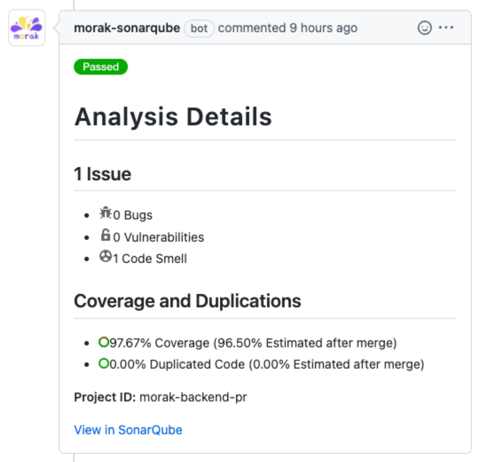
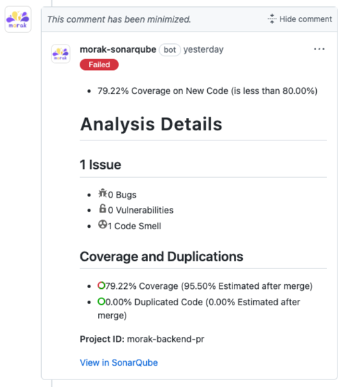

안녕하세요 모임을 즐겁게, 편하게! 모락팀의 에덴입니다.

저희는 기능 개발에 몰두하면서 테스트에 다소 소홀했습니다.

그래서 팀 내부 회의를 거친 결과, 테스트에 관심을 가지고 테스트 케이스를 늘리기로 결정했습니다.

하지만 테스트 케이스를 늘려도 기존에 있던 로직들을 모두 커버하지 못해 에러가 발생하거나, 새로운 로직에 대한 테스트 커버리지 또한 확실하게 알 수 없는 상황이었습니다.

이에 테스트 코드 커버리지를 정량적으로 측정하고 문서화를 할 수 있는 툴을 도입하기로 결정하고 jacoco 를 적용하였습니다.

### jacoco 채택 이유

jacoco 적용 이전까지는 인텔리제이의 `Run with Coverage` 기능을 자주 사용하였습니다.

하지만 쉽게 접근이 가능하다는 장점이 있었지만, 문서화가 어렵고 측정 기준을 세부화하기 힘들어 JaCoCo 도입을 결정하였습니다.

JaCoCo 를 채택한 이유는 다음과 같습니다.

1. 문서화가 쉽습니다.

설정을 통해 측정된 결과를 html, xml 등의 파일 형태로 만들어낼 수 있습니다.

2. 더 자세하다.

세부적인 설정으로 측정 단위, 기준 등을 세부적으로 설정할 수 있습니다.

3. 테스트 커버를 강제할 수 있다.

측정된 결과가 설정한 단위 및 기준에 대한 규칙을 통과하지 못하면 build 에 실패하게 됩니다.

## 기본 설정

앞으로 기술될 gradle 은 Groovy DSL 을 기반으로 합니다.

기본적인 설정은 다음과 같습니다.

```groovy
plugins {
	id 'jacoco'
}

jacoco {
	toolVersion = '0.8.7'
}

jacocoTestReport {
  reports {
    html.enabled true
    xml.enabled true
    csv.enabled false
  }
}

jacocoTestCoverageVerification {
  violationRules {
    rule {
      element = 'CLASS'

      limit {
        counter = 'BRANCH'
        value = 'COVEREDRATIO'
        minimum = 0.90
      }
    }
  }
}

```

- plugin 
  - jacoco 플러그인을 추가합니다.
- jacoco {} 
  - jacoco plugin 에 대한 설정을 할 수 있습니다.
  - toolVersion 이외에도 reportsDirectory 를 설정할 수 있으며 기본값은 `$buildDir/reports/jacoco` 입니다.

jacoco plugin 에는 `jacocoTestReport` 와 `jacocoTestCoverageVerification` 두 가지 task 가 있습니다.

- jacocoTestReport
  - 바이너리로 된 커버리지 결과를 여러 파일 형태로 저장합니다. html 은 결과 분석용, xml과 csv는 외부 분석 도구와의 연동을 위해 만듭니다.
- jacocoTestCoverageVerification
  - 원하는 커버리지 기준(룰)을 세울 수 있습니다. 기준을 충족하지 못한다면 build 가 실패하게 됩니다.

```shell
./gradlew test jacocoTestReport jacocoTestCoverageVerification
```

규칙을 통과하지 못하면 build 가 실패합니다.


## 두 task 를 한번에!

```groovy
task testCoverage(type: Test) {
  group 'verification'
  description 'Runs the unit tests with coverage'

  dependsOn(':test',
            ':jacocoTestReport',
            ':jacocoTestCoverageVerification')

  tasks['jacocoTestReport'].mustRunAfter(tasks['test'])
  tasks['jacocoTestCoverageVerification'].mustRunAfter(tasks['jacocoTestReport'])
}
```

testCoverage 라는 task 를 만들고 해당 task 에서 위의 두 task 를 묶을 수 있습니다.

- group
  - gradle 의 task 는 여러가지 그룹(Application, Build, Build Setup, Documentation, Verification)으로 나뉩니다.
  - `./gradlew tasks` 명령어로 task 들의 정보를 확인할 수 있습니다.

- mustRunAfter
  - mustRunAfter 으로 태스크 순서를 지정해줄 수 있습니다.
  - mustRunAfter 는 dependsOn 보다 후순위입니다. [참고](https://as-you-say.tistory.com/142#h2-7) 

이 설정으로 `./gradlew testCoverage` 명령어는 `./gradlew test jacocoTestReport jacocoTestCoverageVerification` 명령어와 같은 실행을 할 수 있습니다.

```shell
./gradlew testCoverage
```

## 세부 설정

jacocoTestCoverageVerification 에서 커버리지 기준을 자세하게 설정 자세하게 설정할 수 있습니다.

다음은 모락 팀이 정의한 룰입니다.

```groovy
tasks.named('jacocoTestCoverageVerification') {
    violationRules {
        rule {
            element = 'CLASS'

            limit {
                counter = 'BRANCH'
                value = 'COVEREDRATIO'
                minimum = 0.80
            }

            limit {
                counter = 'LINE'
                value = 'COVEREDRATIO'
                minimum = 0.70
            }

            limit {
                counter = 'METHOD'
                value = 'COVEREDRATIO'
                minimum = 0.60
            }

            excludes = [
                    '**.*Formatter*',
                    '**.*BaseEntity*',
                    '**.*GithubOAuthClient*',
                    '**.*MorakBackApplication*',
                    '**.*Interceptor*',
                    '**.*Extractor*',
                    '**.RestSlackClient',
                    '**.*Config'
            ]
        }

        rule {
            element = 'METHOD'

            limit {
                counter = 'LINE'
                value = 'TOTALCOUNT'
                maximum = 200
            }
        }
    }
}
```

violationRules 속성에서 rule 을 정의할 수 있으며, 여러 개의 rule 을 정의할 수 있습니다.

- element
  - 커버리지를 체크할 기준을 설정합니다.
  - 가능한 값으로는 BUNDLE, PACKAGE, CLASS, GROUP, SOURCEFILE, METHOD 가 있으며 기본 값은 BUNDLE 입니다. 

- counter
  - 커버리지 측정의 최소 단위입니다.
  - 가능한 값으로는 INSTRUCTION, LINE, BRANCH, COMPLEXITY, METHOD, CLASS 가 있으며 기본 값은 INSTRUCTION 입니다.

- value
  - 커버리지를 측정할 단위입니다.
  - 가능한 값으로는 TOTALCOUNT, MISSEDCOUNT, COVEREDCOUNT, MISSEDRATIO, COVEREDRATIO 가 있으며 기본 값은 COVEREDRATIO 입니다.

위의 3개를 조합해서 사용할 수 있습니다.

ex)

1. Package, method, COVEREDRATIO → 패키지의 메서드의 커버비율
2. METHOD, BRANCH, COVEREDRATIO → 메서드의 분기의 커버비율
3. CLASS, LINE, TOTALCOUNT → 클래스의 라인의 총 갯수

- includes
  - 각각의 rule 에서 지정된 element 를 기준으로, 포함할 element 를 지정할 수 있습니다.
  - 기본 값은 모든 element 입니다([(*]).

- excludes
  - 각각의 rule 에서 지정된 element 를 기준으로, 제외할 element 를 지정할 수 있습니다.
  - 기본 값은 빈 list 입니다. 
  - ant 스타일로 값을 지정할 수 있습니다.

더 자세한 설명은 [공식 문서](https://docs.gradle.org/current/javadoc/org/gradle/testing/jacoco/tasks/rules/JacocoViolationRule.html)를 참고해주세요!

### 메서드 제외하기


서비스 로직 상 equals 와 hashCode 를 재정의한 로직이 있는데, 굳이 테스트할 필요가 없어서 테스트 케이스에 추가하지 않았습니다.

하지만 해당 메서드를 테스트하지 않으면 지정한 rule 의 `BRANCH` 와 `METHOD` 에서 걸려, 빌드가 실패하게 되었습니다.

테스트 커버리지를 위해 불필요한 테스트 케이스를 추가하기보다는 해당 메서드를 측정에서 제외하기로 결정하였습니다.

> 위의 rule 에서 exclude 할 수 있는 항목들로는 해당 exclude 설정이 포함되어 있는 rule 의 element 값입니다. 
>
> 해당 rule 의 element 값이 `CLASS` 이기때문에 해당 rule 에서 exclude 로는 `equals` 메서드를 제외할 수 없습니다.

JaCoCo 0.8.2 부터 `'Generated' 라는 이름이 포함` 되어있고 `RetentionPolicy 가 'CLASS' 또는 'Runtime'` 인 어노테이션이 붙어있으면 
해당 Target 은 JaCoCo 측정에서 제외됩니다.

```java
@Documented
@Retention(RUNTIME)
@Target({TYPE, METHOD})
public @interface Generated {
}
```

```java
    @Override
@Generated
public boolean equals(Object o) {
        // ...
        }
```


### lombok 관련 제외하기

NoArgsConstructor, Getter 등의 lombok 어노테이션을 많이 이용하였습니다.

하지만 해당 lombok 관련 메서드들도 테스트 커버리지에서 잡혀 빌드가 실패하는 경우가 생겼습니다.

이에 lombok.config 파일을 project 의 root path 에 생성하고 다음의 설정을 해줍니다.

```lombok.config
lombok.addLombokGeneratedAnnotation = true
```

모든 lombok 으로 생성된 메서드에 대해 앞서 기술했던 generated 어노테이션을 붙인다는 설정입니다.

이외에도 lombok 관련 주의사항과 더 많은 설정은 [Lombok 사용상 주의점(Pitfall)](https://kwonnam.pe.kr/wiki/java/lombok/pitfall) 을 참고해주세요!

### 적용 후

PR 시 SonarQube 로 코드 정적 분석과 함께 JaCoCo 로 측정된 결과에 대해서도 분석하여 분석 결과를 PR 덧글로 알려줄 수 있도록 하였습니다.

앞서 설정한 4개의 규칙을 통과하지 못하면 build 에 실패하게 되고, SonarQube 에서도 전체적인 통과 기준을 80% 로 잡아 전체 코드에 대해서도 테스트 커버리지에 대해 측정할 수 있도록 하였습니다.





이상으로 모락팀의 JaCoCo 적용기에 대해 알아보았습니다!
