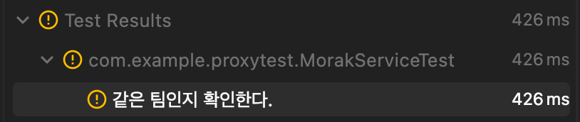
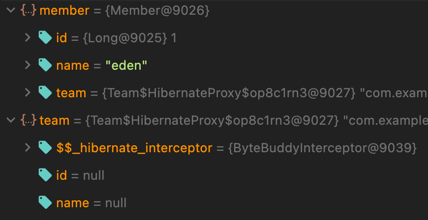
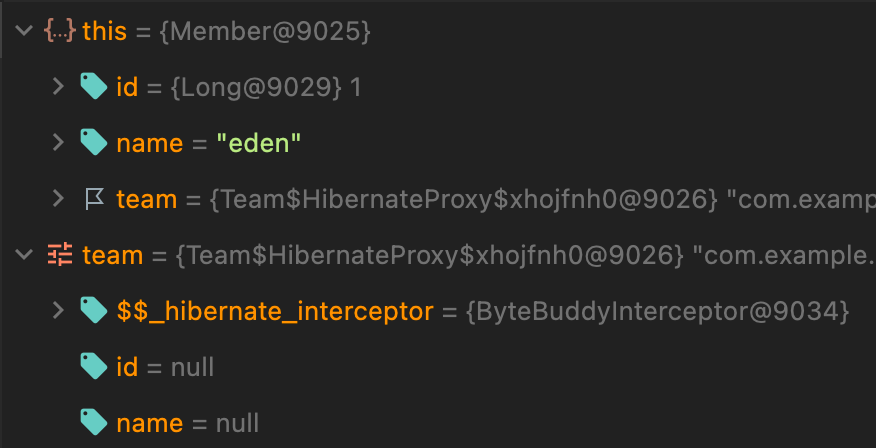
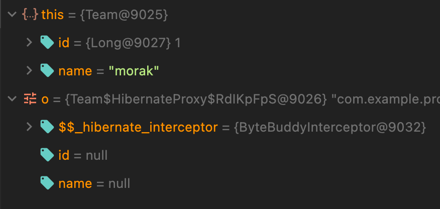

## 마주한 문제 상황

프로젝트 중 도메인 객체를 equals 로 비교해야 할 로직이 필요했습니다.

그래서 findById 로 객체를 불러서 비교를 하려고 하는데 원하는대로 결과가 나오지 않았습니다.

디버그를 찍어보니 비교하는 과정에서 계속 인자로 들어온 비교할 객체가 프록시 객체 상태였습니다.

기본 세팅

```java

@Entity
@NoArgsConstructor
@Getter
public class Team {

    @Id
    @GeneratedValue(strategy = GenerationType.IDENTITY)
    private Long id;

    private String name;

    @Override
    public boolean equals(Object o) {
        if (this == o)
            return true;
        if (o == null || getClass() != o.getClass())
            return false;
        Team team = (Team) o;
        return Objects.equals(getId(), team.getId()) && Objects.equals(getName(), team.getName());
    }

    @Override
    public int hashCode() {
        return Objects.hash(id, name);
    }
}
```

```java

@Entity
@NoArgsConstructor
@Getter
public class Member {

    @Id
    @GeneratedValue(strategy = GenerationType.IDENTITY)
    private Long id;

    private String name;

    @ManyToOne(fetch = FetchType.LAZY)
    private Team team;

    public boolean isTeam(Team team) {
        return this.team.equals(team);
    }
}
```

같은 상황을 만들기 위해 equals 를 재정의하였고 1:N 으로 연관 관계를 설정하였습니다.

```java

@Service
@RequiredArgsConstructor
public class MorakService {

    private final MemberRepository memberRepository;
    private final TeamRepository teamRepository;

    public boolean test(Long memberId, Long teamId) {
        Member member = memberRepository.findById(teamId).orElseThrow();
        Team team = teamRepository.findById(memberId).orElseThrow();

        return member.isTeam(team);
    }
}
```

로직은 member 와 team 을 찾아와 비교하는 로직입니다.

테스트를 위해 더미 데이터는 다음과 같이 넣어주었습니다.

### Team

| id  | name  |
|-----|-------|
| 1   | morak |

### Member

| id  | name | team_id |
|-----|------|---------|
| 1   | eden | 1       |

```java
@Test
@DisplayName("같은 팀인지 확인한다.")
void test(){
//given
        Long memberId=1L;
        Long teamId=1L;

        //when
        boolean isSameTeam=morakService.test(memberId,teamId);

        //then
        assertThat(isSameTeam).isTrue();
        }
```

테스트를 돌려보면 실패합니다.



## 과정

디버그를 돌려보았습니다.



member 의 team 과 team 둘 다 프록시 객체로 설정되어 있습니다.

### 의문 1

`프록시 객체와 프록시 객체의 비교인데 왜 false 가 나타났을까?`

디버그를 조금 더 들어가 보았습니다.

#### member.isTeam(team) 메서드 내부의 디버그

<details>
<summary>member.isTeam(team)</summary>
<div markdown="1">

    public boolean isTeam(Team team) {
        return this.team.equals(team);
    }

</div>
</details>



현재까지도 this(member) 의 team 과 파라미터로 들어온 team 모두 같은 프록시 객체입니다.

#### Override 한 team.equals(team) 메서드 내부의 디버그

<details>
<summary>team.equals(team)</summary>
<div markdown="1">

    @Override
    public boolean equals(Object o) {
        if (this == o)
            return true;
        if (o == null || getClass() != o.getClass())
            return false;
        Team team = (Team)o;
        return Objects.equals(getId(), team.getId()) && Objects.equals(getName(), team.getName());
    }

</div>
</details>



this 인 member 의 team 이 비로소 실제 데이터를 가진 객체가 되었습니다.

하지만 파라미터로 들어온 team 은 여전히 프록시 객체이기때문에 getClass() != o.getClass() 에서 false 로 처리가 되었습니다.

### 의문 2

`member 의 team 은 fetch type 을 lazy 로 해서 그렇다고 하고, findById 로 찾은 team 까지 왜 프록시 객체로 되어 있을까?`

console 에 보면 쿼리까지 나가지만 찾아온 team 객체는 프록시 객체였습니다.

자세한 이유는 모르지만, 팀 내부적으로 추측하건데

> 찾아온 team 객체가 이미 영속성 컨텍스트에 저장되어 있는 member 의 team 과 id 가 일치
>
> 같은 객체인 것을 알아차린 뒤, 동일성 보장을 위해 가져온 객체를 버리고 기존에 member 의 team 객체와 같은 프록시 객체로 대체
>

와 같은 흐름으로 추측하였습니다.

### 의문 3

`언제 메서드 호출이 프록시 객체를 실제 객체로 초기화하는 것일까?`

결론부터 말씀드리자면 __*프록시 객체의 메서드가 호출될 때*__ 입니다.

프록시 객체의 메서드가 호출되면 ProxyConfiguration 내부의 InterceptorDispatcher 클래스의 intercept 메서드가 먼저 실행됩니다.

```java

public interface ProxyConfiguration {

    // ...
    interface Interceptor {

        @RuntimeType
        Object intercept(@This Object instance, @Origin Method method, @AllArguments Object[] arguments)
                throws Throwable;
    }

    class InterceptorDispatcher {

        @RuntimeType
        public static Object intercept(
                @This final Object instance,
                @Origin final Method method,
                @AllArguments final Object[] arguments,
                @StubValue final Object stubValue,
                @FieldValue(INTERCEPTOR_FIELD_NAME) Interceptor interceptor
        ) throws Throwable {
            if (interceptor == null) {
                if (method.getName().equals("getHibernateLazyInitializer")) {
                    return instance;
                } else {
                    return stubValue;
                }
            } else {
                return interceptor.intercept(instance, method, arguments); // 1
            }
        }
    }
}
```

interceptor 가 null 이 아니기때문에 1이 실행됩니다.

그리고 ProxyConfiguration.Interceptor 인터페이스에서 선언된 intercept(instance, method, arguments) 메서드를 호출합니다.

```java

public class ByteBuddyInterceptor extends BasicLazyInitializer implements ProxyConfiguration.Interceptor {

    // ...
    public Object intercept(Object proxy, Method thisMethod, Object[] args) throws Throwable {
        Object result = this.invoke(thisMethod, args, proxy);
        if (result == INVOKE_IMPLEMENTATION) {
            Object target = getImplementation();
            final Object returnValue;
            try {
                if (ReflectHelper.isPublic(persistentClass, thisMethod)) {
                    if (!thisMethod.getDeclaringClass().isInstance(target)) {
                        // ...
                    }
                    returnValue = thisMethod.invoke(target, args); // - 2
                }

                // ...

                return returnValue;
            } catch (InvocationTargetException ite) {
                throw ite.getTargetException();
            }
        } else {
            return result;
        }
    }

    protected final Object invoke(Method method, Object[] args, Object proxy) throws Throwable {
        String methodName = method.getName();
        int params = args.length;

        if (params == 0) {
            // ...
        } else if (params == 1) {
            if (!overridesEquals && "equals".equals(methodName)) { // - 1
                return args[0] == proxy;
            } else if (method.equals(setIdentifierMethod)) {
                initialize();
                setIdentifier((Serializable) args[0]);
                return INVOKE_IMPLEMENTATION;
            }
        }
    }
}
```

ByteBuddyInterceptor 클래스는 ProxyConfiguration.Interceptor 를 구현한 구현체입니다.

먼저 invoke() 메서드로 프록시 객체에서 호출된 메서드(equals)가 실제 데이터를 가져와야 하는 메서드인지 확인합니다.

해당 객체(Team)에서 equals 를 오버라이드했기때문에 1번의 !overridesEquals 에서 false 가 되고 INVOKE_IMPLEMENTATION 을 리턴합니다.

이후 getImplementation() 으로 영속성 컨텍스트에서 실제 데이터를 가진 객체를 가져오고, 앞서 호출한 메서드(equals)가 2번의 thisMethod.invoke( target, args ); 로
실행됩니다.

## 해결 방법

1. fetch type 을 EAGER 로 바꾸기

지연 로딩을 하지 않고 바로 불러오기때문에 이후에 불러오는 team 도 프록시 객체가 아닌 실제 객체가 됩니다.
하지만 팀 내부 회의 결과 굳이 매번 EAGER 로 불러올 필요성을 느끼지 못하여 다른 방안을 생각하였습니다.

2. find 하는 순서를 바꾼다.

```
Team team = teamRepository.findById(memberId).orElseThrow();
Member member = memberRepository.findById(teamId).orElseThrow();
```

team 을 먼저 불러 해당 team 이 바로 실제 객체가 되도록 합니다.

하지만 근본적인 해결책이 아니기때문에 매번 순서를 생각해야 하기 때문에 다른 방법을 찾아보았습니다.

3. equals 를 override 하지 않기

ByteBuddyInterceptor 의 invoke() 메서드에서 !overrideEquals 가 true 가 되어 두 객체 모두 프록시 객체로 남아 프록시 객체끼리의 비교가 됩니다.

아무리 JPA 가 영속성 컨텍스트를 통해 동일성을 보장할 수 있다지만 괜히 찝찝하여 마지막 방법으로 결정하였습니다.

4. equals override 커스텀하기

override 한 equals 에서 getClass() != o.getClass() 부분을 지워주고, 변수끼리 비교할 때 파라미터로 들어온 team 객체에서 getter 를 사용하여 멤버 변수 비교를 할 수 있도록
하였습니다.

```java
public boolean equals(Object o){
        if(this==o){
            return true;
        }
        if(o==null){
            return false;
        }
        Team team=(Team)o;
        
        return Objects.equals(id,team.getId())&&Objects.equals(name,team.getName());
        }
```

해당 로직으로 가기로 했지만, 커스텀한 equals 이기때문에 주의가 필요합니다.
